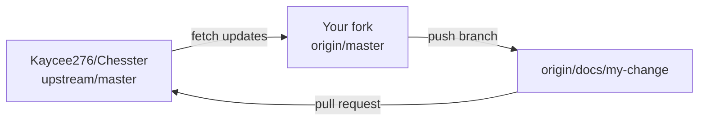

# Contributing to Chesster ♟️

Thank you for your interest in contributing to **Chesster**, a decentralized chess game on the Stellar network powered by Soroban smart contracts!

We welcome contributions of all kinds: bug fixes, new features, UI/UX improvements, documentation updates, and smart contract enhancements.

---

## 📋 Table of Contents

- [Getting Started](#getting-started)
- [First-Time Contributor Walkthrough](#first-time-contributor-walkthrough)
- [How to Claim an Issue](#how-to-claim-an-issue)
- [Development Setup](#development-setup)
  - [Prerequisites](#prerequisites)
  - [Backend Setup](#backend-setup)
  - [Frontend Setup](#frontend-setup)
  - [Smart Contracts Setup](#smart-contracts-setup)
- [Commit & Branching Guidelines](#commit--branching-guidelines)
- [Submitting a Pull Request](#submitting-a-pull-request)
- [Community & Support](#community--support)

---

## 🚀 Getting Started

1. **Find an Issue**: Browse our [GitHub Issues](https://github.com/Kaycee276/Chesster/issues). Look out for issues tagged with:
   - `good first issue`: Ideal for first-time contributors.
   - `help wanted`: Open for community contribution.
   - `bug`: Needs fixing.
   - `enhancement`: Feature improvements.
2. **Propose an Issue**: If you find a bug or have a feature idea that isn't listed, please [create a new issue](https://github.com/Kaycee276/Chesster/issues/new/choose) first before submitting a PR.

---

## 🧭 First-Time Contributor Walkthrough

This walkthrough assumes that this is your first contribution with Git. It uses a fork so you can safely experiment without write access to the main repository.

### 1. Prepare your GitHub account

1. Sign in to GitHub and click **Fork** on the [Chesster repository](https://github.com/Kaycee276/Chesster). Keep the default options and create the fork under your account.
2. Install [Git](https://git-scm.com/downloads), then set the name and email that should appear on your commits:

   ```bash
   git config --global user.name "Your Name"
   git config --global user.email "you@example.com"
   ```

3. Install the tools in [Prerequisites](#prerequisites). If you are new to a terminal, GitHub’s [Git and GitHub learning videos](https://www.youtube.com/@GitHub/videos) and Stellar’s [developer videos](https://www.youtube.com/@StellarDevelopmentFoundation) are useful companions to this guide.

### 2. Clone your fork and add the upstream remote

Replace `<your-username>` with your GitHub username. `origin` points to your fork; `upstream` points to the project you are contributing to.

```bash
git clone https://github.com/<your-username>/Chesster.git
cd Chesster
git remote add upstream https://github.com/Kaycee276/Chesster.git
git remote -v
```

Expected relationship:



### 3. Start every change from the current `master`

Do not work directly on `master`. Update your local copy first, then create one focused branch. Replace the sample name with a concise description of your change.

```bash
git switch master
git fetch upstream
git pull --ff-only upstream master
git push origin master
git switch -c docs/describe-your-change
```

If `git switch` is unavailable, use `git checkout master` and `git checkout -b docs/describe-your-change` instead.

### 4. Make, verify, and save the change

Follow the setup instructions below, edit only the files needed for the issue, and run the checks relevant to the area you changed. Review your work before committing:

```bash
git status
git diff
git add CONTRIBUTING.md
git commit -m "docs(contributing): clarify first contribution flow"
```

Use `git add <file>` rather than `git add .` when you have unrelated local changes. The pre-commit hook may format or check staged files; review `git status` again if it does.

### 5. Push your branch and open a pull request

```bash
git push -u origin docs/describe-your-change
```

Open the URL Git prints, choose `master` in `Kaycee276/Chesster` as the base branch, and use a Conventional Commit PR title. In the description, explain the change, list checks run, and add `Closes #149` (or the issue you completed).

### Keeping an open branch current

Before addressing review feedback, incorporate the latest `master` without creating a merge commit:

```bash
git fetch upstream
git rebase upstream/master
git push --force-with-lease
```

If Git reports a conflict, resolve the marked files, run `git add <resolved-file>`, then continue with `git rebase --continue`. Ask in the PR if you are unsure which version is correct.

### Development branch rules

- Branch from the current `upstream/master`; PRs target `master`.
- Keep one issue or tightly related change per branch and PR.
- Never force-push `master`. `--force-with-lease` is appropriate only for your own feature branch after a rebase.
- Use the [branch names](#branch-naming-pattern) and [commit format](#commit-messages--pull-request-titles) below.
- Keep commits reviewable and do not commit secrets, `.env` files, generated build output, or unrelated formatting changes.

---

## 🙋‍♂️ How to Claim an Issue

To prevent duplicate work:

1. Leave a comment on the issue asking to be assigned (e.g., _"I'd like to work on this issue! Please assign me."_).
2. Wait for a maintainer to assign the issue to you before you start coding.
3. If an assigned contributor is inactive for more than **5 days**, the issue may be reassigned.

---

## 🛠 Development Setup

### Prerequisites

- **Node.js** (v20+) & `npm`
- **Rust** (latest stable) & **Soroban CLI**
- **Freighter Wallet** browser extension

### 1. Fork & Clone

```bash
git clone https://github.com/<your-username>/Chesster.git
cd Chesster
```

### 2. Backend Setup

```bash
cd backend
cp .env.example .env
npm install
npm run dev
```

### 3. Frontend Setup

```bash
cd frontend
cp .env.example .env
npm install
npm run dev
```

### 4. Smart Contracts Setup (Soroban)

```bash
cd contracts/soroban
rustup target add wasm32-unknown-unknown
cargo build --target wasm32-unknown-unknown --release
cargo test
```

---

## 🏷 Commit & Branching Guidelines

We follow the **Conventional Commits** specification for clear git history:

### Branch Naming Pattern

- `feat/short-description` (e.g., `feat/wallet-disconnect-button`)
- `fix/short-description` (e.g., `fix/board-flip-bug`)
- `docs/short-description` (e.g., `docs/update-setup-instructions`)

### Commit Messages & Pull Request Titles

We enforce the **Conventional Commits** specification for all commit messages and Pull Request titles. Incoming PR titles are automatically validated via GitHub Actions (`.github/workflows/pr-lint.yml`).

#### Format

```text
<type>(<optional scope>): <subject>
```

#### Allowed Types

| Type       | Description                                        | Example                                                    |
| ---------- | -------------------------------------------------- | ---------------------------------------------------------- |
| `feat`     | New feature or capability                          | `feat(frontend): add dark mode toggle`                     |
| `fix`      | Bug fix                                            | `fix(backend): correct chess move validation for castling` |
| `docs`     | Documentation changes                              | `docs(readme): add troubleshooting section`                |
| `style`    | Formatting, whitespace, or non-functional styles   | `style(frontend): format chess board styles`               |
| `refactor` | Code refactoring without bug fixes or new features | `refactor(contracts): optimize escrow storage keys`        |
| `perf`     | Performance improvements                           | `perf(backend): cache active game states`                  |
| `test`     | Adding or updating tests                           | `test(backend): add escrow timeout unit tests`             |
| `build`    | Changes to build system or dependencies            | `build(frontend): update vite to v7`                       |
| `ci`       | CI/CD configurations and scripts                   | `ci(actions): add PR title linter workflow`                |
| `chore`    | General maintenance tasks                          | `chore: update license and metadata`                       |
| `revert`   | Reverting previous commits                         | `revert: revert PR #42`                                    |

> ⚠️ **Note**: The `<subject>` must start with a lowercase letter (e.g. `feat(api): add endpoint`, not `feat(api): Add endpoint`).

---

## 📥 Submitting a Pull Request

1. **Keep PRs Focused**: Address one issue per Pull Request.
2. **Follow PR Title Conventions**: Use a valid Conventional Commit title format as described above so the automated PR linter passes.
3. **Run Tests**: Ensure all checks pass locally before opening a PR:
   - Backend: `cd backend && npm test`
   - Frontend: `cd frontend && npm run lint && npm test && npm run build`
   - Contracts: `cd contracts/soroban && cargo test`
4. **Reference the Issue**: Include `Fixes #<issue-number>` or `Closes #<issue-number>` in your PR description.
5. **Request Review**: Tag a maintainer for review once your PR is ready.

---

## 📦 Automated Release & Versioning

Chesster uses [semantic-release](https://github.com/semantic-release/semantic-release) to automate versioning, changelog updates, and GitHub Release creation whenever changes are merged into the default branch (`main` / `master`).

### Semantic Versioning Rules

Release notes and version bumps are determined automatically from commit messages following the **Conventional Commits** specification:

| Commit Type                                       | Release Impact           | Example Commit Message                          |
| ------------------------------------------------- | ------------------------ | ----------------------------------------------- |
| `fix:`                                            | Patch Release (`v1.0.1`) | `fix(backend): resolve escrow timeout handling` |
| `feat:`                                           | Minor Release (`v1.1.0`) | `feat(frontend): add move history exporter`     |
| `feat:` / `fix:` with `BREAKING CHANGE:`          | Major Release (`v2.0.0`) | `feat(contracts)!: migrate escrow contract API` |
| `chore:`, `docs:`, `style:`, `refactor:`, `test:` | No Release               | `docs: update setup documentation`              |

### Automated Release Artifacts

Upon a successful release workflow execution:

1. `semantic-release` calculates the new semver version based on commit history since the last tag.
2. Updates `CHANGELOG.md` with release notes and commits the updated changelog.
3. Compiles the optimized Soroban smart contract WASM (`escrow.wasm`) and attaches it directly to the GitHub Release.

---

Thank you for contributing to Chesster! 🚀
