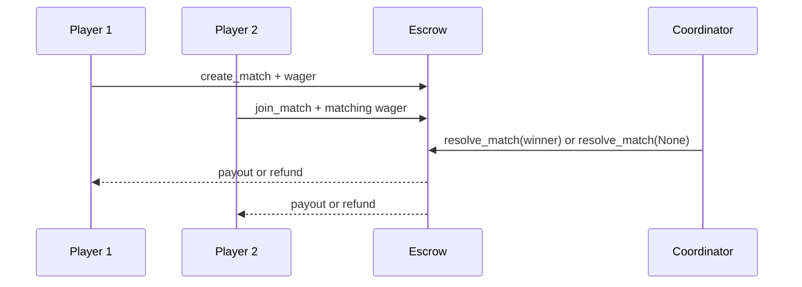

# Chesster Escrow Deployment Runbook

This runbook deploys the Soroban escrow contract to Testnet or Mainnet using the Stellar CLI. Treat Mainnet deployment as a change-management operation: review the WASM, use a controlled coordinator account, record the contract ID, and test every administrative transaction before enabling users.

## Prerequisites

- Rust with the `wasm32-unknown-unknown` target.
- A current [Stellar CLI](https://developers.stellar.org/docs/tools/cli) (`stellar`; older installations may use `soroban`).
- A funded source account. Testnet funding is available from the [Stellar Friendbot](https://friendbot.stellar.org/).
- A deployed Stellar Asset Contract (SAC) address for each wager token. The native XLM SAC address must also be configured before using native-match helpers.

Never place a secret key in a shell history, committed file, CI log, or application `.env` shared with users. The examples reference an identity already added to your local CLI key store.

## 1. Build and test the artifact

From `contracts/soroban`:

```bash
rustup target add wasm32-unknown-unknown
cargo test
cargo build --target wasm32-unknown-unknown --release
```

The deployable artifact is `target/wasm32-unknown-unknown/release/escrow.wasm`. Optionally optimize it with `make optimize` before deployment; verify and retain the exact WASM used for the release.

## 2. Configure a network and deploy

Replace `testnet` with `mainnet` only after completing the Mainnet checklist below. Add a CLI identity through the CLI’s supported key-management command, then deploy using that identity:

```bash
stellar contract deploy \
  --network testnet \
  --source coordinator \
  --wasm target/wasm32-unknown-unknown/release/escrow.wasm
```

Save the returned contract ID in a secure deployment record and in the backend/frontend configuration that needs it. For installations that still expose the legacy binary, replace `stellar` with `soroban` for equivalent contract commands.

## 3. Initialize and configure

The deploy transaction creates code and an instance, but the contract must be initialized before privileged or settlement operations. Invoke methods using the deployed ID, coordinator identity/address, and a reviewed fee in basis points (for example, `500` is 5%). CLI argument syntax can vary by installed CLI version; confirm the generated command with `stellar contract invoke --help`.

```bash
export CONTRACT_ID='<deployed-contract-id>'
export COORDINATOR_ADDRESS='<coordinator-public-key>'

stellar contract invoke \
  --network testnet \
  --source coordinator \
  --id "$CONTRACT_ID" \
  -- init \
  --coordinator "$COORDINATOR_ADDRESS" \
  --admin_bps 500
```

Then configure the tokens and risk limits your deployment permits. Calls below are templates: use real SAC IDs and integer token units (stroops for XLM), and make every coordinator action from the coordinator identity.

```bash
stellar contract invoke --network testnet --source coordinator --id "$CONTRACT_ID" -- add_supported_token --token '<token-sac-id>'
stellar contract invoke --network testnet --source coordinator --id "$CONTRACT_ID" -- set_native_xlm_address --native_token '<native-xlm-sac-id>'
stellar contract invoke --network testnet --source coordinator --id "$CONTRACT_ID" -- set_wager_limits --min_wager 1 --max_wager 100000000
stellar contract invoke --network testnet --source coordinator --id "$CONTRACT_ID" -- set_match_timeout --timeout_secs 3600
```

Read back configuration before publishing the contract ID:

```bash
stellar contract invoke --network testnet --id "$CONTRACT_ID" -- get_coordinator
stellar contract invoke --network testnet --id "$CONTRACT_ID" -- get_fee_bps
stellar contract invoke --network testnet --id "$CONTRACT_ID" -- get_wager_limits
```

## 4. Smoke-test Testnet

1. Create two funded test accounts and grant the contract the required token allowance where the SAC requires it.
2. Create a match with Player 1, then join it with Player 2.
3. Query `get_match` and confirm it is `Active` and the locked total equals two wagers.
4. Resolve once as the coordinator and verify payout, fee recipient, emitted event, and the final `Resolved` state.
5. Independently exercise a draw/refund path on another test match.

The relevant transition is:



## Mainnet release checklist

- [ ] Review the source commit, tests, generated WASM hash, configuration values, and coordinator/treasury addresses with another maintainer.
- [ ] Use a dedicated, access-controlled coordinator account; verify its recovery and signing procedures.
- [ ] Deploy using `--network mainnet`; save the contract ID and transaction hash outside the repository.
- [ ] Initialize, configure permitted tokens and wager limits, and read each value back.
- [ ] Perform a small-value end-to-end match and settlement before announcing the integration.
- [ ] Update the production backend and frontend contract-ID configuration only after smoke testing succeeds.

## Rollback and incident response

Soroban contracts are immutable at a deployed ID. Do not attempt to “roll back” by changing source code locally. Pause client traffic, preserve transaction IDs and configuration evidence, communicate the affected contract ID, and deploy/configure a new contract only after reviewing the incident. Never rotate or disclose a coordinator secret through issue comments or logs.
