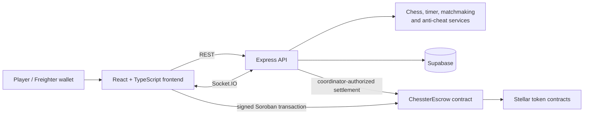
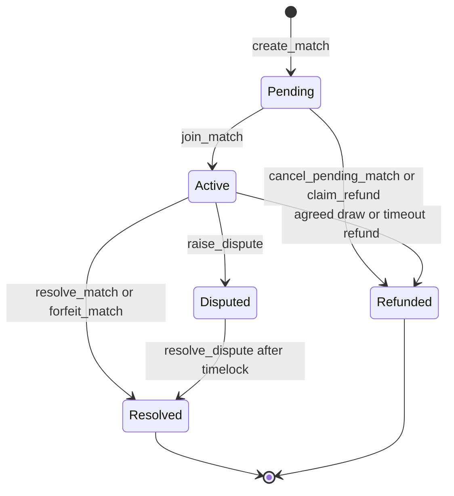

# Chesster Architecture

Chesster combines a React client, an Express/Socket.IO game service, Supabase persistence, and a Soroban escrow contract. Chess-rule evaluation and live game coordination are performed by the backend; token custody and settlement are performed by the contract.

## Components



| Component                             | Responsibility                                                                             |
| ------------------------------------- | ------------------------------------------------------------------------------------------ |
| `frontend/`                           | Wallet-aware UI, board state, API requests, and Socket.IO subscriptions.                   |
| `backend/`                            | Game endpoints, chess validation, timers, WebSocket rooms, and persistence orchestration.  |
| `backend/services/escrowService.js`   | Server-side contract integration for configured coordinator actions.                       |
| `contracts/soroban/contracts/escrow/` | Wager custody, participant authorization, payouts, refunds, disputes, and contract events. |
| Supabase                              | Persistent games, move history, and chat messages.                                         |

## Match lifecycle

```mermaid
sequenceDiagram
  participant W as White client
  participant B as Backend
  participant C as Escrow contract
  participant K as Black client
  W->>B: Create game
  W->>C: create_match (wallet authorization)
  K->>B: Join game
  K->>C: join_match (wallet authorization)
  C-->>C: Match becomes Active; both wagers are locked
  loop Each move
    W->>B: Submit move
    B-->>W: Validated game state
    B-->>K: game-update via Socket.IO
    K->>B: Submit move
    B-->>W: game-update via Socket.IO
  end
  B->>C: resolve_match / forfeit_match as coordinator
  C-->>W: Winner payout, or refund on draw
  C-->>K: Draw refund when applicable
```

The backend should resolve a game only after it has determined a final game result. A client must not treat a backend game update as proof of an on-chain settlement; it should observe the submitted Soroban transaction result.

## Escrow state transitions



`Pending`, `Active`, `Resolved`, and `Refunded` are stored `MatchStatus` values. A dispute is stored separately and temporarily blocks ordinary settlement until its timelock has elapsed and the coordinator resolves it.

## Trust boundaries

- Player wallet addresses must authorize contract deposits.
- The contract coordinator is authorized for configuration and final settlement actions; protect this key and use a controlled operational process.
- The API is authoritative for off-chain chess state, but it cannot move player funds without the contract’s authorization rules.
- Socket.IO events improve responsiveness; REST reads and contract transaction results are the recovery path after missed events or reconnection.
