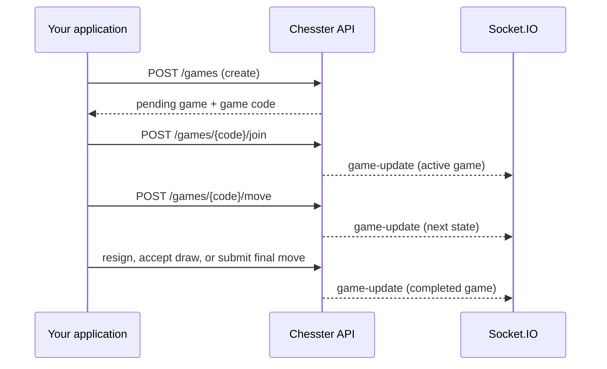

# Chesster JavaScript / TypeScript Integration Guide

This guide describes the HTTP and Socket.IO interfaces exposed by a running Chesster backend. It is intended for third-party clients; it is not a published npm package. Your integration owns authentication, wallet signing, and presentation.

## Before you start

Run the backend and set its public URL in your client. The examples use `http://localhost:3001` because that is the backend’s default port.

```ts
const baseUrl = "http://localhost:3001/api";
```

Every documented game endpoint returns JSON in this shape:

```ts
type ApiResponse<T> = { success: true; data: T } | { success: false; error: string };
```

Treat a non-2xx response or `success: false` as an error. The exact game object can grow over time, so clients should use only fields they need.

## Match lifecycle



On-chain escrow is a separate concern. Create or join the matching Soroban escrow transaction from the player wallet, then use the game API for chess state. See [the deployment runbook](../contracts/soroban/DEPLOYMENT.md) for contract administration.

## REST API

### Create a game

`POST /games`

```ts
async function createGame(playerWhiteAddress: string) {
  const response = await fetch(`${baseUrl}/games`, {
    method: "POST",
    headers: { "Content-Type": "application/json" },
    body: JSON.stringify({
      gameType: "chess",
      playerWhiteAddress,
      wagerAmount: 1.5,
      timeControlSeconds: 600,
      timeIncrementSeconds: 0,
      // gameCode is optional; the server can generate one.
    }),
  });
  return response.json();
}
```

`gameType`, `wagerAmount`, `playerWhiteAddress`, `timeControlSeconds`, `timeControlPreset`, `timeIncrementSeconds`, and `gameCode` are accepted. A successful response is `201` with `{ success: true, data: game }`.

### Discover, join, and read games

| Operation                | Request                       | Important input                                                                  |
| ------------------------ | ----------------------------- | -------------------------------------------------------------------------------- |
| List joinable games      | `GET /games/pending`          | None                                                                             |
| Read a game              | `GET /games/{gameCode}`       | URL-encoded game code                                                            |
| Join a game              | `POST /games/{gameCode}/join` | `{ playerColor: "black", playerAddress }`                                        |
| Get history              | `GET /games`                  | Optional `playerAddress`, `status`, dates, pagination, and sort query parameters |
| Get moves                | `GET /games/{gameCode}/moves` | Game code                                                                        |
| Get time-control presets | `GET /time-controls`          | None                                                                             |

Only join an available game using the color your product has assigned. The server starts its clock once the game becomes active.

### Submit a move and game actions

Chess squares are zero-based `[row, column]` coordinate pairs. Include `promotion` when a pawn reaches the final rank.

```ts
await fetch(`${baseUrl}/games/${encodeURIComponent(gameCode)}/move`, {
  method: "POST",
  headers: { "Content-Type": "application/json" },
  body: JSON.stringify({ from: [6, 4], to: [4, 4] }),
});
```

| Operation         | Request body                                                            |
| ----------------- | ----------------------------------------------------------------------- |
| Resign            | `POST /games/{gameCode}/resign` — `{ playerColor }`                     |
| Offer draw        | `POST /games/{gameCode}/draw/offer` — `{ playerColor, playerAddress? }` |
| Accept draw       | `POST /games/{gameCode}/draw/accept` — `{}`                             |
| Request undo      | `POST /games/{gameCode}/undo/request` — `{ playerColor }`               |
| Accept undo       | `POST /games/{gameCode}/undo/accept` — `{ playerColor }`                |
| Reject undo       | `POST /games/{gameCode}/undo/reject` — `{}`                             |
| Read chat history | `GET /games/{gameCode}/chat`                                            |

## Real-time updates

Install `socket.io-client` and connect to the backend origin (not `/api`). Join with the object form to participate in presence updates.

```ts
import { io } from "socket.io-client";

const socket = io("http://localhost:3001");
socket.emit("join-game", { gameCode, playerColor: "white" });
socket.on("game-update", (game) => renderGame(game));
socket.on("timer-tick", (clock) => renderClock(clock));
socket.on("chat-message", (message) => appendChat(message));

socket.emit("send-chat", { gameCode, playerColor: "white", message: "Good luck!" });
```

Available server events are `game-update`, `timer-tick`, `chat-message`, `presence-update`, `presence-snapshot`, and `player-reconnected`. Call `socket.emit("leave-game", gameCode)` when leaving and disconnect when your application no longer needs live updates.

## Escrow API

The backend also exposes `GET /api/escrow/info`, `GET /api/escrow/{gameCode}`, and coordinator-oriented `POST` routes for `create`, `join`, and `resolve`. These routes depend on backend-held contract configuration and are not a replacement for player-authorized wallet transactions. Third-party player clients should integrate the Soroban contract directly and only invoke privileged resolution with an authorized coordinator.

## Production checklist

- Use HTTPS and a production Socket.IO origin.
- Set an explicit backend CORS origin; do not rely on the development wildcard.
- URL-encode every `gameCode` placed in a path.
- Re-fetch the game after reconnecting; sockets are notifications, not the source of truth.
- Validate and display failed transactions and API errors to the user.
