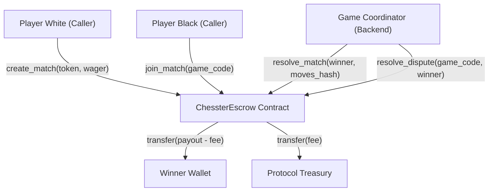

# Soroban Smart Contract Architecture & Event Ingestion Guide

This document provides a comprehensive technical reference for integrating with Chesster's on-chain Soroban escrow smart contract (`contracts/soroban/contracts/escrow/src/lib.rs`). It covers contract storage architecture, the complete error code catalog, token precision conventions, dispute lifecycles, and instructions for local sandbox testing with `stellar-cli`.

---

## 1. Architectural Overview & Trust Model

Chesster combines off-chain chess engine validation with non-custodial Soroban smart contracts for token wagering, fee distribution, and escrow settlement.



### Trust & Security Boundaries
- **Player Authorization**: Players must sign token allowance/transfer operations to deposit wager funds into escrow. Funds cannot be seized or wagered without player transaction authorization.
- **Coordinator Authority**: The backend coordinator wallet is authorized to settle concluded matches, execute refunds for expired timeouts, and manage wager limits.
- **Circuit Breaker & Reentrancy Guards**: The contract enforces a strict reentrancy lock (`symbol_short!("reentr")`) across all mutating functions and provides an emergency pause mechanism (`symbol_short!("paused")`).
- **Storage TTL Management**: Contract state is auto-extended when remaining ledger lifetime drops below `STORAGE_TTL_THRESHOLD` (103,680 ledgers, ~6 days) to `STORAGE_TTL_EXTENDED` (518,400 ledgers, ~30 days).

---

## 2. Storage Layout & Data Keys

The escrow contract leverages both instance storage (for global protocol configurations) and persistent/temporary storage keyed via the `DataKey` enum.

### Instance Storage Keys
| Key Symbol | Rust Type | Description |
|:---|:---|:---|
| `coord` | `Address` | Protocol coordinator address authorized for settlement. |
| `fee` | `u32` | Protocol fee in basis points (max 1,000 bps = 10%). |
| `treasury` | `Address` | Destination vault for collected protocol fees. |
| `reentr` | `bool` | Transaction-scoped reentrancy lock flag. |
| `paused` | `bool` | Emergency circuit breaker flag disabling new match creation. |
| `min_wager` | `i128` | Inclusive global minimum wager allowed across all tokens. |
| `max_wager` | `i128` | Inclusive global maximum wager allowed across all tokens. |

### DataKey Enum (Persistent & Temporary Entries)
```rust
#[contracttype]
#[derive(Clone, Debug, Eq, PartialEq)]
pub enum DataKey {
    PlayerRating(Address),      // Persistent on-chain Elo rating and games played
    Metrics,                    // Global contract metrics and performance counters
    AccountNonce(Address),      // Account deposit sequence nonce for replay protection
    DrainSchedule,              // Timelocked emergency migration recipient schedule
}
```

---

## 3. Complete Error Code Catalog

The escrow contract defines stable numeric discriminants via `#[contracterror]` in `EscrowError`. All client and backend services should match against these codes:

| Code | Error Enum | Cause | Recommended Action |
|:---:|:---|:---|:---|
| `0` | `NotInitialized` | Contract has not been initialized yet. | Invoke `init` with coordinator and fee configuration before matches. |
| `1` | `MatchNotFound` | Specified game code was not found in storage. | Verify the `game_code` string passed by the client. |
| `2` | `MatchAlreadyExists` | Match with specified game code already exists. | Generate a fresh unique game code before match creation. |
| `3` | `InvalidWager` | Wager amount is non-positive or zero. | Supply a positive `i128` wager amount strictly greater than zero. |
| `4` | `MatchNotPending` | Operation requires match in `Pending` state. | Verify match has not already been joined, cancelled, or started. |
| `5` | `AlreadyJoined` | Player or spectator has already joined/bet. | Prevent duplicate join requests from the same wallet. |
| `6` | `CannotJoinOwnMatch` | Creator attempted to join their own match as opponent. | Match creator cannot act as second player; join from distinct wallet. |
| `7` | `MatchNotActive` | Action requires match in `Active` status. | Ensure both players have deposited and match is actively in-progress. |
| `8` | `InvalidWinner` | Specified winner address is not an authorized match participant. | Pass either Player White, Player Black, or `None` (for draw). |
| `9` | `AlreadyResolvedOrRefunded` | Match is already concluded or refunded. | Check match status before dispatching settlement transactions. |
| `10` | `TimeoutNotReached` | Refund timeout period (1 hour) has not elapsed. | Wait until match expiration timestamp exceeds current ledger time. |
| `11` | `Unauthorized` | Caller lacks authorization for coordinator action. | Sign transaction with configured coordinator private key. |
| `12` | `InsufficientFunds` | Player token balance is insufficient for wager. | Fund player account with required wager token balance before deposit. |
| `13` | `MaxActiveMatchesReached` | Player reached maximum concurrent active matches (5). | Conclude existing active matches before creating or joining new ones. |
| `14` | `InvalidTournament` | Tournament status or parameter is invalid. | Verify tournament identifier and registration requirements. |
| `15` | `SideBetNotFound` | Side bet entry was not found. | Verify side wager ticket identifier. |
| `16` | `SideBetClosed` | Match side pool is closed for new wagers. | Submit side bets before match moves to closed wagering window. |
| `17` | `CancellationAlreadyRequested` | Cancellation request was already recorded. | Wait for opponent confirmation or timeout refund. |
| `18` | `TokenNotWhitelisted` | Specified wager token is not in whitelisted assets. | Deposit supported token asset (e.g. native XLM or official USDC). |
| `19` | `TokenAlreadyWhitelisted` | Token was already added to the whitelist. | Avoid duplicate whitelist invocation for existing token address. |
| `20` | `NotForfeitable` | Match is not eligible for forfeit. | Forfeit can only occur while match remains in active state. |
| `21` | `InvalidForfeitPlayer` | Caller attempting forfeit is not an active participant. | Ensure forfeit invocation is signed by registered player wallet. |
| `22` | `InsufficientAllowance` | Token allowance granted to contract is insufficient. | Invoke token `approve` with allowance >= wager amount. |
| `23` | `AlreadyDisputed` | Dispute has already been raised for this match. | Await coordinator resolution; multiple disputes are blocked. |
| `24` | `DisputeNotFound` | Dispute record not found in contract storage. | Verify match has active dispute status before arbitration. |
| `25` | `DisputeTimeLockActive` | Dispute timelock (48 hours) is currently active. | Wait for `DISPUTE_TIMELOCK_SECS` (172,800s) cooldown to expire. |
| `26` | `InvalidBatchSize` | Batch resolution size is empty or exceeds limit (10). | Limit batch resolution submissions to between 1 and 10 matches. |
| `27` | `MatchNotStale` | Match is not stale (>30 days old). | Only garbage-collect concluded matches older than 30 days. |
| `28` | `MatchExpired` | Match expired based on ledger timestamp timeout. | Claim timeout refund or cancel match. |
| `29` | `WagerBelowMinimum` | Wager is below configured minimum threshold. | Increase wager amount to meet `min_wager`. |
| `30` | `WagerAboveMaximum` | Wager exceeds configured maximum threshold. | Reduce wager amount to stay within `max_wager`. |
| `31` | `InvalidWagerLimit` | Minimum wager limit exceeds maximum or is non-positive. | Ensure `0 < min_wager <= max_wager` when updating thresholds. |
| `32` | `ContractPaused` | Circuit breaker engaged; contract is paused. | Wait for coordinator to unpause contract before creating matches. |
| `33` | `RotationNotProposed` | Coordinator key rotation has not been proposed. | Propose rotation before calling approval endpoints. |
| `34` | `RotationAlreadyProposed` | Rotation already proposed for a different address. | Conclude or cancel existing rotation proposal. |
| `35` | `AlreadyApproved` | Signer has already approved pending rotation. | Avoid duplicate approval submissions from same signer. |
| `36` | `UnauthorizedSigner` | Caller is not an authorized multisig signer. | Verify multisig signer credentials. |
| `37` | `ReentrancyGuard` | Reentrant call detected on guarded escrow function. | Avoid recursive contract calls during deposit/settlement hooks. |
| `38` | `InvariantViolated` | Contract balance invariant or arithmetic check failed. | Check token balance reconciliation and intermediate overflows. |
| `39` | `NotPaused` | Emergency drain requires contract to be paused. | Pause contract before attempting migration drain. |
| `40` | `MigrationNotAuthorized` | Emergency drain requires authorized migration window. | Coordinator must authorize migration window before draining. |
| `41` | `TreasuryVaultNotSet` | Emergency drain requires treasury vault destination. | Configure valid treasury vault address in instance storage. |
| `42` | `NothingToDrain` | No positive token balance available to drain. | Confirm positive token balance exists before triggering drain. |
| `43` | `NonceAlreadyUsed` | Replay protection nonce has already been consumed. | Increment account nonce sequence for new signature payloads. |
| `44` | `InvalidNonce` | Submitted account nonce does not match expected sequence. | Fetch current account nonce from storage and provide `nonce + 1`. |
| `45` | `InvalidMatchDuration` | Match duration outside allowable bounds (120s - 86,400s). | Configure match timer between 2 minutes and 24 hours. |
| `46` | `TimeoutNotExpired` | Match timer has not expired yet. | Wait for allotted match timer duration to elapse before claiming timeout. |
| `47` | `NoCancellationProposed` | No mutual cancellation proposal exists for match. | Initiate cancellation proposal before attempting confirmation. |
| `48` | `CannotConfirmOwnProposal`| Player cannot confirm their own cancellation proposal. | Second player must confirm cancellation proposal. |
| `49` | `UnauthorizedPlayer` | Caller is not an authorized participant in match. | Only matched players or coordinator may invoke player endpoints. |

---

## 4. Token Precision & Arithmetic Rules

Soroban contracts represent Stellar token amounts as signed 128-bit integers (`i128`).
- **Precision**: 7 decimal places (1 Stroop = $10^{-7}$ tokens).
- **Example**: `1.50 USDC` is represented on-chain as `15_000_000` stroops.
- **Basis Points (BPS)**: Protocol fee calculations use $10,000$ as the denominator (`BPS_DENOMINATOR = 10_000`).
  $$\text{Fee} = \frac{\text{Total Pot} \times \text{Fee BPS}}{10,000}$$
  $$\text{Winner Payout} = \text{Total Pot} - \text{Fee}$$

Arithmetic functions use strict overflow checks:
- `checked_add` and `checked_sub` panic with `EscrowError::InvariantViolated` on underflow/overflow.
- `checked_mul_div(env, a, b, denom)` verifies $a \times b$ does not overflow `i128` prior to dividing by `denom`.

---

## 5. Local Sandbox Testing with `stellar-cli`

Developers can verify contract interactions locally without depending on Testnet availability.

### Step 1: Install `stellar-cli` & Build Contract
```bash
cargo install --locked stellar-cli --features opt

# From repo root
cd contracts/soroban
cargo build --target wasm32-unknown-unknown --release
```

### Step 2: Start Local Soroban Network
```bash
stellar network start local
```

### Step 3: Configure Identities & Mint Test Tokens
```bash
stellar keys generate alice --network local
stellar keys generate bob --network local
stellar keys generate coordinator --network local

stellar keys fund alice --network local
stellar keys fund bob --network local
stellar keys fund coordinator --network local
```

### Step 4: Deploy Contract & Initialize
```bash
# Deploy WASM
CONTRACT_ID=$(stellar contract deploy \
  --wasm target/wasm32-unknown-unknown/release/chesster_escrow.wasm \
  --source coordinator \
  --network local)

# Initialize escrow (fee: 250 bps = 2.5%)
stellar contract invoke \
  --id $CONTRACT_ID \
  --source coordinator \
  --network local \
  -- init \
  --coordinator $(stellar keys address coordinator) \
  --fee_bps 250 \
  --treasury $(stellar keys address coordinator)
```

### Step 5: Test Match Lifecycle (Create, Join, Resolve)
```bash
# Alice creates a match for 10 USDC (100,000,000 stroops)
stellar contract invoke \
  --id $CONTRACT_ID \
  --source alice \
  --network local \
  -- create_match \
  --game_code "CHESS-LOCAL-001" \
  --token <USDC_CONTRACT_ID> \
  --wager 100000000

# Bob joins the match
stellar contract invoke \
  --id $CONTRACT_ID \
  --source bob \
  --network local \
  -- join_match \
  --game_code "CHESS-LOCAL-001"

# Coordinator resolves match with Alice as winner
stellar contract invoke \
  --id $CONTRACT_ID \
  --source coordinator \
  --network local \
  -- resolve_match \
  --game_code "CHESS-LOCAL-001" \
  --winner $(stellar keys address alice) \
  --moves_hash "e3b0c44298fc1c149afbf4c8996fb92427ae41e4649b934ca495991b7852b855"
```